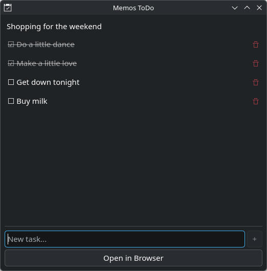
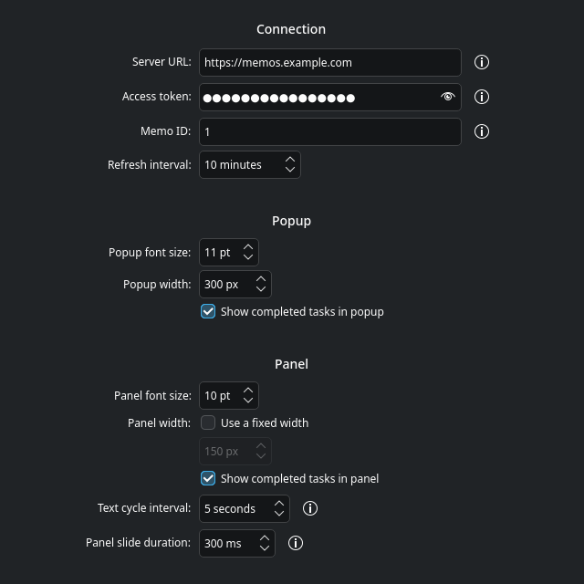

# Memos ToDo for KDE Plasma

A KDE Plasma 6 widget that shows and edits a to-do list stored in a memo on
your [UseMemos](https://usememos.com/) server. This is the KDE port of the
[Cinnamon applet](https://github.com/WACOMalt/memos-todo/tree/linux-cinnamon),
with the same features and settings.



## Features

- **Live sync**: shows the tasks of one memo, and fetches it again at the
  refresh interval.
- **Panel label**: cycles through the lines of the memo, with a slide
  animation.
- **Check tasks**: click a task in the popup to check or uncheck it.
- **Add tasks**: type in the "New task..." field and press Enter or click "+".
- **Delete tasks**: click the trash icon next to a task.
- **Open in Browser**: opens the memo on your Memos server.
- **Customizable**: font sizes, popup width, fixed panel width, cycle
  interval, slide duration, and whether to show completed tasks.
- **Translated** into Arabic, Chinese (Simplified), French, Hindi, Japanese
  and Spanish.

A line that starts with `☐ ` is an open task, and a line that starts with
`☑ ` is a completed task. Plain lines under a task belong to that task. Every
Memos ToDo client uses this format.

## Requirements

- KDE Plasma 6.0 or later
- A UseMemos server, an API access token, and the ID of the memo to show

## Installation

### From the KDE Store

Right-click the panel, select "Add Widgets", then "Get New Widgets" >
"Download New Plasma Widgets", and search for "Memos ToDo".

### From the source

```
git clone -b linux-kde https://github.com/WACOMalt/memos-todo.git
cd memos-todo
./install.sh
```

Then right-click the panel, select "Add Widgets", and add "Memos ToDo".

## Configuration

Right-click the widget and select "Configure Memos ToDo...".



| Setting | Default | Description |
| --- | --- | --- |
| Server URL | `https://memos.example.com` | The base URL of your Memos server |
| Access token | (empty) | Your API access token, without the `Bearer ` prefix |
| Memo ID | `1` | The ID of the memo to show, from the memo URL: `<server>/memos/<id>` |
| Refresh interval | 10 minutes | How often to fetch the memo again |
| Popup font size | 11 pt | |
| Popup width | 300 px | |
| Show completed tasks in popup | on | |
| Panel font size | 10 pt | |
| Panel width | automatic | Check "Use a fixed width" to set a width in pixels |
| Show completed tasks in panel | on | |
| Text cycle interval | 5 seconds | Time to show each line before the next |
| Panel slide duration | 300 ms | 0 ms turns the animation off |

The right-click menu also has "Refresh" and "Open in Browser".

## Differences from the Cinnamon applet

- When "Show completed tasks in popup" is off, the Cinnamon applet deletes
  the hidden completed tasks from the memo the next time you change a task.
  This widget keeps them.
- "Open in Browser" opens `<server>/memos/<id>`, the memo URL of current
  Memos versions.
- The Plasma popup can be resized. The task list takes the extra height.

## Development

- `tests/run-tests.sh`: unit tests for the memo parser. Needs Node.js.
- `tests/mock-memos-server.py`: a small stand-in for a Memos server, to test
  the widget without real data.
- `po/update-pot.sh`: extracts the strings into `po/memos-todo.pot` and
  merges them into the `.po` files.
- `make-plasmoid.sh`: builds `dist/memos-todo-<version>.plasmoid` for the
  KDE Store. See [PUBLISHING.md](PUBLISHING.md).

## License

MIT. See [LICENSE](LICENSE).
